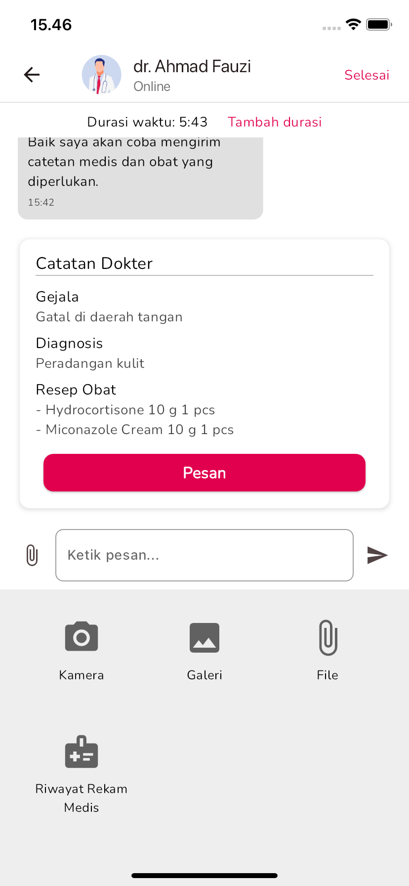

# Healthcare Super App

## Description
This super app provides a range of healthcare services that are easily accessible through mobile devices. The application implements several core functionalities derived from case studies of various healthcare applications with integrated features.

## Screenshots

  
  
  

## Features
- Online Consultation with Doctors
- Order Medications Online
- Schedule Offline Appointments
- View Medical History

## Technologies
- Flutter
- Firebase Authentication
- Firebase Firestore

## Architecture (Clean Architecture)

